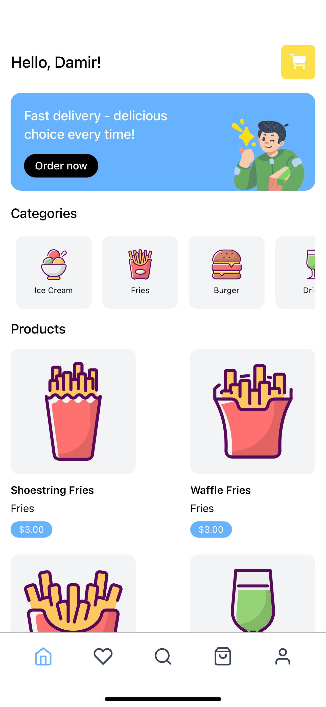
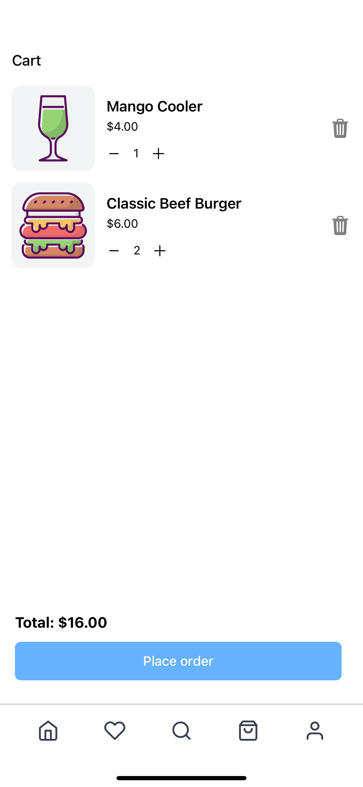
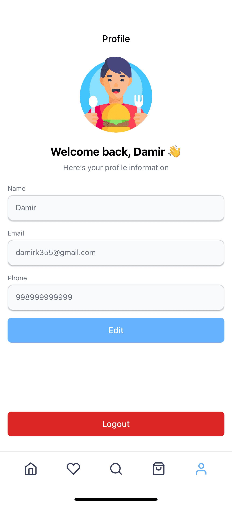

# 🛵 Delivery App

**Delivery App** is a modern fullstack solution for managing food delivery operations. Built with a scalable and modular architecture, it provides a smooth experience for both users and administrators with a focus on reliability and performance.

---

## 🎥 Live Demo

[▶️ Watch Demo Video](./demo/live-demo.mp4)

Click the link above to see the app in action.

---

## 🖼️ Screenshots

  
  
  

---

## 🚀 Tech Stack

### 📱 Client – React Native (Expo)

- **Framework:** React Native (with Expo)
- **UI Libraries:**
  - NativeWind (TailwindCSS)
  - Expo Vector Icons
  - Custom Components
- **State Management:** Redux Toolkit + Redux Persist
- **Navigation:** React Navigation
- **Forms:** React Hook Form
- **Networking:** Axios, Tanstack Query
- **Payments:** Stripe React Native SDK
- **Security:** Expo Secure Store

### 🔧 Server – NestJS (TypeScript)

- **Framework:** NestJS
- **ORM:** Prisma
- **Database:** PostgreSQL 
- **Authentication:** JWT + Passport
- **Encryption:** Argon2
- **Validation:** class-validator / class-transformer
- **Email Service:** Nodemailer
- **Payments:** Stripe API

---

> **Delivery App** — a modern approach to food delivery: convenient, secure, and scalable.
